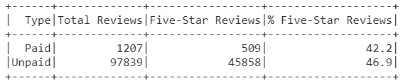

# Amazon Vine Analysis

## Overview

The purpose of this analysis is to compare product reviews from Amazon Vine members and non-members to determine if there is an inherent positivity bias in paying individuals to review products.

## Results

The table below summarizes the results for kitchen products:

- There were 1207 paid Vine reviews and 97,839 non-Vine reviews
- There were 509 five-stars Vine reviews and 45,858 five-star non-Vine reviews
- 42.2% of Vine reviews were five-stars and 46.9% of non-Vine reviews were five-stars

## Summary

Our initial analysis of kitchen product showed no positivity bias for reviews in the Vine program, in fact Vine members gave a lower proportion of 5-star reviews than non-members. 

Further analyses of other sales categories is needed to determine if this trend holds across all departments. 